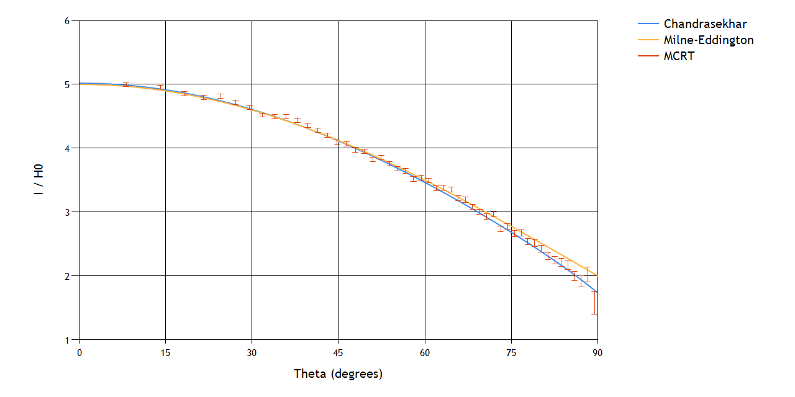
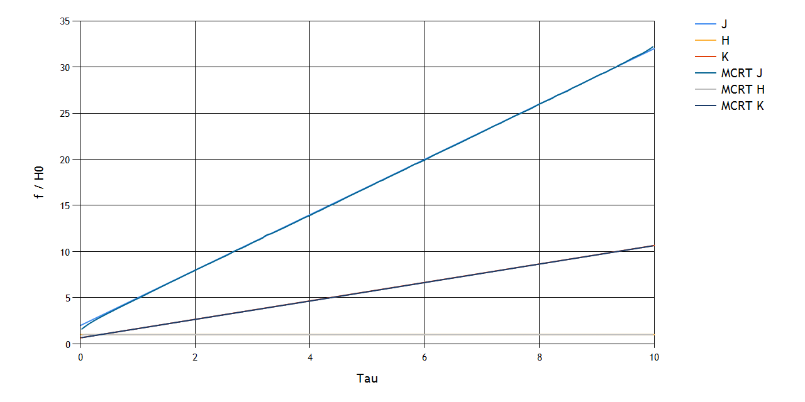
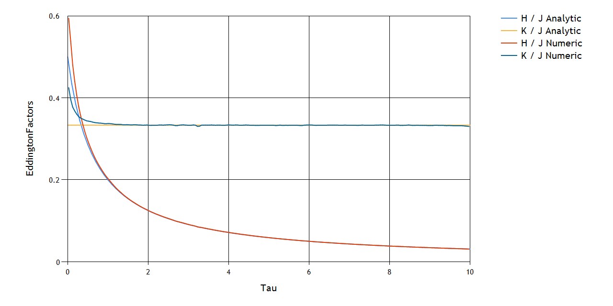
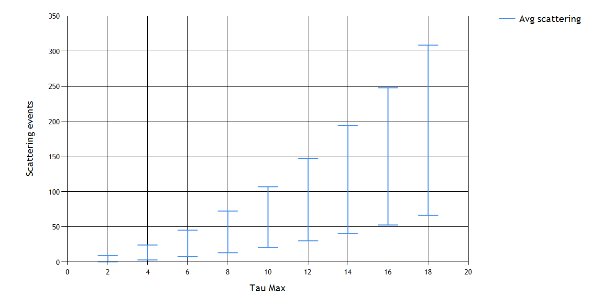
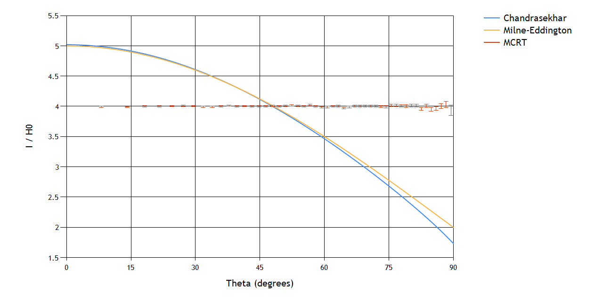

# Monte Carlo Radiative Transfer

## Project Description
This project tries to understand and implement a Monte Carlo Radiative Transfer (MCRT). It does this by simulating photon packages in a semi-infinite plane parallel atmosphere. These photon packages are randomly scattered in the atmosphere. For this simulation isotropic scattering was used. 

## Project structure

### Code
The interesting bits of the code are within the files: Settings.cs, Simulator.cs, Photon.cs and Chart/ChartData.cs.
- **Settings.cs**: Stores the variables used for running the simulations. Tweak these values as you see fit.
- **Simulator.cs**: Creates the Simulator. This Simulator is responsible for the photon packages and storing the results (scatter events, radiation moments) of the photon packages.
- **Photon.cs**: Simulates a single photon packages within a semi-infinite plane parallel atmosphere.
- **Chart/ChartData.cs**: Responsible for creating the data in a format which can be used for the charts. This data can be obtained from an analytical solution or from a simulation.

If there is a need to change the looks of the charts, then that can be done in:
- **Chart/Charts.cs**: Responsible for the general look of the chart. (x range, y range, title, fonts, axis labels, etc.)
- **Chart/ChartSeries.cs**: Holds the default look for a Series. And is responsible for adding the data from **Chart/ChartData.cs** into the Series.

## Results
<figure>
    
    <figcaption>Fig.1 - Plots the outgoing intensity of the photon packages with a particular degree. As can be seen the numerical solution tends to agree with the Chandrasekhar solution as opposed to the Milne-Eddington solution. Parameters: N0 = 500.000, Tmax = 10, muCells= 50.</figcaption>
</figure>
<figure>
    
    <figcaption>Fig.2 - Plots the different radiation moments for both the analytical solutions and the numerical results.  Parameters: N0 = 500.000, Tmax = 10, zCells = 200.</figcaption>
</figure>
<figure>
    
    <figcaption>Fig.3 - Plots the different Eddington factors for both the analytical solutions and numerical results. As can be seen the analytical and numerical results do not match at very low values of Tau. This can be explained since there is no isotropic scattering at the highest place in the atmosphere. Since once the photon packages have escaped the atmosphere they won't scatter back. Parameters: N0 = 500.000, Tmax = 10, zCells = 200.</figcaption>
</figure>
<figure>
    
    <figcaption>Fig.4 - Plots the number of scatter events needed to escape a atmosphere of Tmax. As can be seen the number of scatter events needed to escape the atmosphere go up as the optical depth of the atmosphere increases. The variance also goes up. Parameters: N0 = 500.000.</figcaption>
</figure>
<figure>
    
    <figcaption>Fig.5 - Plots the outgoing intensity of the photon packages for each degree. However for this plot the scattering is turned off. As can be seen, the intensity is independent and thus is our ground source a Lambertian surface. Parameters: N0 = 5.000.000, Tmax = 10, muCells = 50.</figcaption>
</figure>
